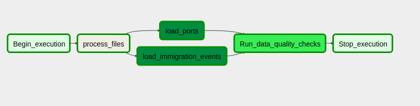
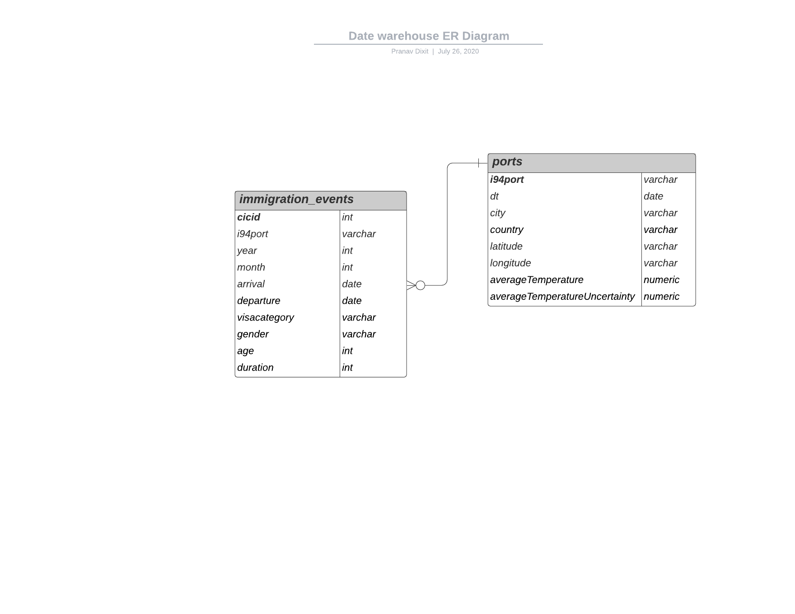

# Project Overview

In this project, we build a data warehouse to analyse immigration events in the United States with chararcteristics of the place visited (specifically temperature). We build a data warehouse with tables: immigration_events - having the information corresponding to the immigration events such as cicid (id of the event), i94port (place of visit), arrival date, departure date, duration and ports - having the information for ports such as i94port, city, country, average temperature.

# Data

The data for the project includes 2 datasets:

- ### I94 Immigration Data: 
  This data comes from the US National Tourism and Trade Office. A data dictionary is included in the workspace. [This](https://travel.trade.gov/research/reports/i94/historical/2016.html) is where the data comes from. There's a sample file so you can take a look at the data in csv format before reading it all in. You do not have to use the entire dataset, just use what you need to accomplish the goal you set at the beginning of the project.

- ### World Temperature Data: 
  This dataset came from Kaggle. You can read more about it [here](https://www.kaggle.com/berkeleyearth/climate-change-earth-surface-temperature-data).


# Setting up your environment for the project

## Prerequisites
- AWS Redshift
- Airflow: Use this [link](https://airflow.apache.org/docs/stable/start.html) to setup Airflow
- pyspark

## Getting started

1. #### Clone the repository
```
$ git clone https://github.com/pranavdixit8/dend-capstone-project.git
```
2. #### Set up your environement and install all the dependencies
```
$ virtualenv dend-capstone-project
$ source dend-capstone-project/bin/activate
$ pip install -r requirements.txt
```
3. #### Unzip the data folders

4. #### Setup your Airflow

> - Use the airflow.cfg file to configure your Airflow setup
> - Update the dags and plugin folder path in the airflow.cfg file

5. #### Add your aws credentials in the dl.cfg file
6. #### Create connections in Airflow

>- aws_credentials: connection to Amazon Web Services
>- redshift: connection to redshift


# Design

### Data pipeline

We preprocesss the data for immigration events and ports using Spark and upload the processed data to AWS S3. The data from S3 is loaded into AWS Redshift and we run quality checks on the data.




### Tables

 - ***immigration_events***:
 > Columns : cicid, i94port, year, month, arrival, departure, visaCategory, gender, age, duratio
 > >
 > >Primary key : cicid
 
 - ***ports***:
 > Columns: i94port, date, city, country, latitude, longitude, averageTemperature, averageTemperatureUncertainity
 > >
 > >Primary key: i94port




# Use cases

- **If the data was increased by 100x**

  We have already used data partitioning using the Airflow default variables, to divide the data depending on the month, year. If the data is increased 100x, we have to see if the data on a monthly basis has incread 100x or we are bringing in historical data into the data warehouse. If we have increased  the data 100x by bringing the historical data, the above solution will work as the data will be divided into month chucks of data as now and Airflow will use its backfill functionality to load the data. In this use case, we can think of scaling out our Redshift cluster for better read performance. 

  If the data is increased 100x on a monthly basis, we will have to have an AWS EMR cluster to preprocess the data making sure the preprocessing of data doesnot becomes the bottleneck. We will have to look into scaling out our Redshift cluster as well in this use case.

- **If the pipelines were run on a daily basis by 7am**

  This will help in data partitioning for better data pipeline runs and with more up-to-date data in the data warehouse. We will just have to change the schedule from monthly to daily to handle this use case.

- **If the database needed to be accessed by 100+ people**

  In this case, we have to consider the read performance of the data warehouse. We can scale out Redshift cluster to handle this use case, other solution can be configure ElastiCache with Redshift, or even considering using a No-SQL database such as Cassandra.


 
 

 
 